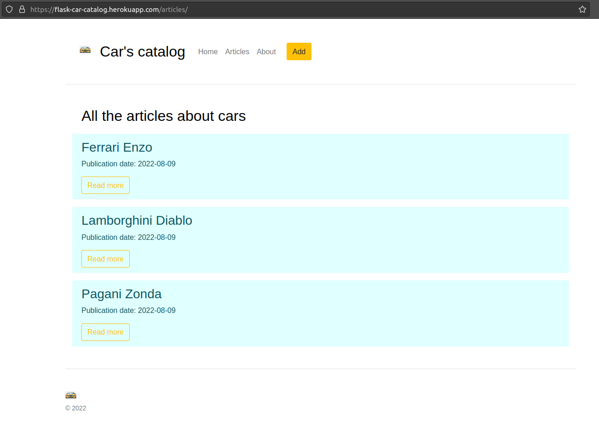

# Car's catalog

Flask project with articles about cars

## Check it out!

[Car's catalog project deployed to Heroku](https://flask-car-catalog.herokuapp.com/)

## Installation

Python3 must be already installed
```shell
git clone https://github.com/alix-mak/flask-cars-catalog
python3 -m venv venv
source venv/bin/activate (on macOS) & venv\Scripts\activate (on Windows)
pip install -r requirements.txt
python3 app.py
```

## Features
* Routing urls for different pages
* Realizing CRUD
* Using Bootstrap's templates

## Demo



